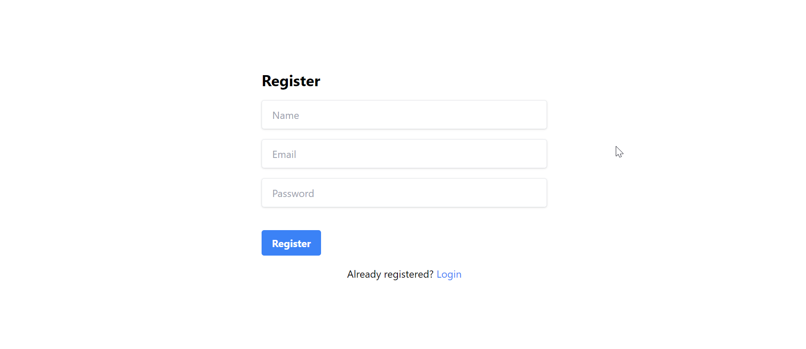
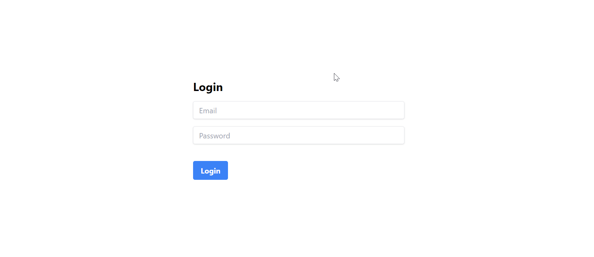
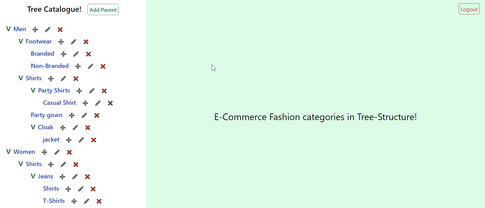

# MERN App

This is a client-server architecture for a MERN (MongoDB, Express.js, React.js, Node.js) app.

## Instructions

1. **Client-Server Architecture**: 
   - This application follows a client-server architecture, with the client and server parts separated into different directories.

2. **Running the Client**:
   - Navigate to the `client` directory using the command line.
   - Run the command:
     ```
     npm run start
     ```
   - This will start the React.js client application.

3. **Running the Server**:
   - Navigate to the `server` directory using the command line.
   - Run MongoDB in PORT=27017
   - Run the command:
     ```
     npm run dev
     ```
   - This will start the Node.js server using nodemon, which automatically restarts the server when changes are detected.

4. **UI**
- Register


- Login


- Dashboard



## Additional Notes

- Ensure you have Node.js and npm installed on your system before running the application.
- MongoDB should be installed and running on your local machine or a remote server for the server part to connect to the database (PORT - 27017).

